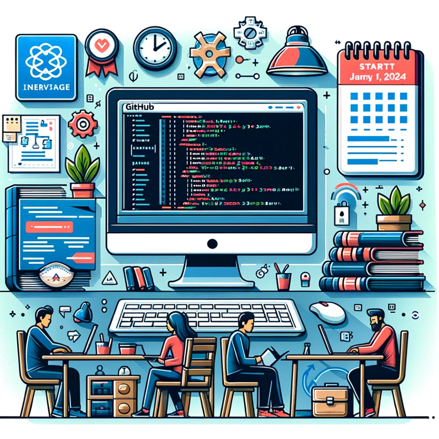

# Technical Interview Mastery: 2024 Edition

Welcome to the **Technical Interview Mastery: 2024 Edition** repository, your go-to resource for preparing for technical interviews in the tech industry. This project is guided by the principles and practices outlined in the Tech Interview Handbook and is designed to help candidates excel in their interviews with a variety of tech companies.

## What's Inside

- **Structured Curriculum:** Detailed breakdown of topics like algorithms, data structures, system design, and coding challenges.
- **Practice Problems:** A collection of problems to test and improve your coding skills.
- **Mock Interview Scenarios:** Real-world interview questions and scenarios to help you prepare effectively.
- **Resources:** https://www.techinterviewhandbook.org/

## Getting Started

To get started with this project:

1. **Clone the Repository:**
   ```bash
   git clone https://github.com/shazaaly/technical_interview_prep
   ```
2. **Navigate to the Repository:**
   ```bash
   cd tech-interview-mastery-2024
   ```
3. **Explore the Directories:**
   - Browse through the folders to find study materials and resources.
   - Check out the `practice_problems` directory for coding exercises.
   - Refer to the `study_sessions` directory for information on upcoming group studies.

## Contributing

We welcome contributions from everyone. Here's how you can contribute:
- **Suggesting Improvements:** Open an issue to suggest improvements or report a bug.
- **Submitting Resources:** Submit a pull request to add new resources or practice problems.
- **Joining Discussions:** Participate in discussions in issues and pull requests.

## Study Group Details

- **Start Date:** January 1, 2024
- **Platform:** [Discord Link](https://forms.gle/7YbyabHY5vqGQt989)
- **Schedule:** [Google Calendar](https://calendar.google.com/calendar/u/0?cid=NmU3YjQ3YzY4NTk5MTcxNGZkNTBlNWRiMzQwOTRmYTliZTc0OTljMmU5ZDUwNDAyNmMwMTAzOWJlMmVjMWU2M0Bncm91cC5jYWxlbmRhci5nb29nbGUuY29t)

## Resources

- [Tech Interview Handbook](https://techinterviewhandbook.org)
- [Data Structures and Algorithms for Tech Interviews ](https://shazaali.substack.com/s/data-structures-algorithm) :  Each lesson in this blog section is divided into two distinct parts:

Core Concepts: This section delves into the theoretical aspects, providing a solid understanding of the fundamental principles of data structures and algorithms.

Logic and Technique: Here, I focus on the application of these concepts. This part is all about the 'how-to' techniques to tackle essential problems.

This dual-approach ensures a holistic understanding—bridging the gap between theory and practice.
Stay tuned for regular updates!

## Contact

- **Email:** [shaza.aly@gmail.com] [cv.bouhlaoui@gmail.com]
- **Discord:** [Discord Link](https://forms.gle/7YbyabHY5vqGQt989)
- **Twitter:** [[Shaza Ali](https://twitter.com/ShazaAlyOthman)] [[Mounssif nuuX BOUHLAOUI](https://twitter.com/nuux_tv)]
- **LinkedIn:** [[Shaza Ali](https://www.linkedin.com/in/shazaali/)] [[Mounssif nuuX BOUHLAOUI](https://www.linkedin.com/in/mounssif-bouhlaoui-25934570/)]
- **GPT:** [[chatGPT](https://chat.openai.com/g/g-btl4eTZS8-data-structures-and-algorithms-explainer-for-faang)]


---

*Together, let's conquer the technical interview challenges of 2024! 🚀*

---
